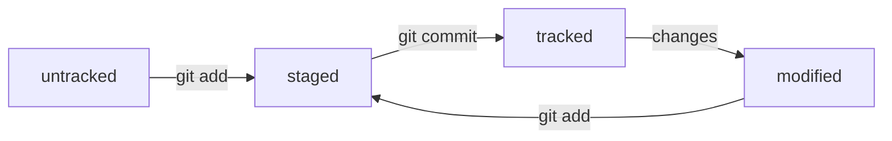

# Git Commands

### Базовые команды для командной строки

|              Command       |                            Description                            |
|----------------------------|-------------------------------------------------------------------|
| `pwd`                      | Показать путь к текущей директории, указать текущее местоположение|
| `ls`                       | Отобразить содержимое в текущей папке                             |
| `ls ~`                     | Отобразить содержимое в домашней директории                       |
| `cd имя_папки`             | Перейти в указанную папку                                         |
| `cd ..`                    | Перейти на уровень выше, в родительскую папку                     |
| `cd ~`                     | Перейти в домашнюю директорию                                     |
| `cd /`                     | Перейти в корневую директорию                                     |
| `touch имя_файла`          | Создать файл с указанным именем в текущей папке                   |
| `cp /имя_файла имя_папки`  | Скопировать файл с указанным именем в указанную папку             |
| `mv /имя_файла имя_папки`  | Переместить файл с указанным именем в указанную папку             |
| `cat имя_файла`            | Распечатать, прочитать содержимое текстового файла                |
| `rm имя_файла`             | Удалить указанный файл                                            |
| `rmdir имя_папки`          | Удалить указанную папку, если она пуста                           |
| `rm -r имя_папки`          | Удалить указанную папку со всем её содержимым                     |


### Инициализация Git-репозитория

  
|                 Command   |                          Description                    |
|---------------------------|---------------------------------------------------------|
| `git init`                | Инициализировать локальный Git-репозиторий              |
| `rm -rf .git`             | Отменить "разгитить" отслеживание в папке               |
| `git status`              | Проверить текущее состояние репозитория                 |


### Добавление и фиксирование изменений

|                Command           |                    Description                          |
|----------------------------------|---------------------------------------------------------|
| `git add имя_файла`              | Подготовить файл к сохранению, к коммиту                |
| `git add --all`                  | Подготовить к сохранению все файлы в репозитории        |
| `git add .`                      | Подготовить к коммиту текущую папку и все файлы в ней   |
| `git commit -m "текст сообщения"`| Зафиксировать изменения, выполнить коммит               |
| `git commit --amend`             | Изменить последний коммит (добавить изменения в коммит) |
| `git log`                        | Просмотреть историю коммитов                            |
| `git log --oneline`              | Просмотр коммитов в компактном виде                     |
| `git diff`                       | Показать различия между рабочим каталогом и последним коммитом |
| `git reset`                      | Отменить изменения, вернуться к состоянию предыдущего коммита |
| `git revert`                     | Отменить изменения, создавая новый коммит для отката изменений |


### Управление ветками

|                Command           |                    Description                          |
|----------------------------------|---------------------------------------------------------|
| `git branch`                     | Показать все ветки в репозитории                         |
| `git branch имя_ветки`           | Создать новую ветку с указанным именем                   |
| `git checkout имя_ветки`         | Переключиться на указанную ветку                         |
| `git checkout -b имя_ветки`      | Создать новую ветку и сразу переключиться на неё         |
| `git merge имя_ветки`            | Слить указанную ветку в текущую ветку                    |
| `git branch -d имя_ветки`        | Удалить локальную ветку (если она была слита)            |
| `git branch -D имя_ветки`        | Принудительно удалить ветку (не проверяя, слита ли она)  |
| `git rebase`                     | Перенос изменений с одной ветки на другую                |
| `git rebase --interactive`       | Запустить интерактивный режим для управления историей коммитов |
| `git checkout -- имя_файла`      | Отменить изменения в указанном файле, вернуть его к последнему коммиту |

### Работа с удаленными репозиториями

|                Command           |                    Description                          |
|----------------------------------|---------------------------------------------------------|
| `git remote add имя_репозитория URL` | Добавить удаленный репозиторий                          |
| `git remote -v`                  | Проверить, что репозитории связаны                      |
| `git fetch`                      | Получить последние изменения из удаленного репозитория, но не сливать их |
| `git pull`                       | Получить и смержить изменения из удаленного репозитория в локальный|
| `git push`                       | Отправить изменения на удаленный репозиторий            |
| `git push --force`               | Принудительно отправить изменения на удаленный репозиторий, перезаписав историю |
| `git push --set-upstream origin имя_ветки` | Установить отслеживание ветки для пуша в удаленный репозиторий |

### Работа с тегами

|                Command           |                    Description                          |
|----------------------------------|---------------------------------------------------------|
| `git tag`                        | Показать все теги в репозитории                          |
| `git tag имя_тега`               | Создать новый тег                                        |
| `git tag -d имя_тега`            | Удалить локальный тег                                    |
| `git push origin имя_тега`       | Отправить тег на удаленный репозиторий                   |
| `git push origin --tags`         | Отправить все теги на удаленный репозиторий              |
| `git tag -a имя_тега -m "сообщение"` | Создать аннотированный тег с описанием                 |

### Работа с субмодулями

|                Command           |                    Description                          |
|----------------------------------|---------------------------------------------------------|
| `git submodule add <url> <путь>` | Добавить субмодуль в проект                             |
| `git submodule init`             | Инициализировать субмодуль                              |
| `git submodule update`           | Обновить субмодули                                     |
| `git submodule status`           | Проверить статус субмодулей                             |

### Управление конфигурацией

|                Command           |                    Description                          |
|----------------------------------|---------------------------------------------------------|
| `git config --global user.name "Имя"` | Установить глобальное имя пользователя                  |
| `git config --global user.email "email@domain.com"` | Установить глобальный email пользователя         |
| `git config --global core.editor "editor"` | Установить глобальный редактор для Git            |
| `git config --list`              | Показать все глобальные настройки Git                    |

### Редкие и дополнительные команды

|                Command           |                    Description                          |
|----------------------------------|---------------------------------------------------------|
| `git stash`                      | Сохранить изменения, чтобы вернуться к чистой рабочей копии |
| `git stash pop`                  | Вернуть изменения из стэша и применить их               |
| `git stash list`                 | Показать все сохраненные изменения в стэше               |
| `git cherry-pick <commit>`       | Применить изменения из выбранного коммита               |
| `git bisect`                     | Найти коммит, который вызвал ошибку в проекте            |
| `git gc`                         | Очистить и оптимизировать репозиторий                   |
| `git reflog`                     | Просмотреть журнал всех изменений, включая удаленные коммиты |


### Хеш — идентификатор коммита


Хеш содержит всю необходимую информацию о коммите: автора и дату коммита и содержимое закоммиченных файлов.
Git хранит таблицу соответствий хеш → информация о коммите. 
Все хеши и таблицу хеш → информация о коммите Git сохраняет в служебные файлы, которые находятся в скрытой папке `.git` в репозитории проекта.
Получить список коммитов с их описанием можно вызвав команду: 
```BASH
$ git log
```


### Лог


После вызова `git log` появляется список коммитов с их описанием:
1. Строка из цифр и латинских букв после слова commit — хеш коммита.
2. Author — имя автора и его электронная почта.
3. Date — дата и время создания коммита.
4. Сообщение к коммиту.

Сокращённый лог вызывается командой `git log --oneline`. В терминале появятся только первые несколько символов хеша (сокращенный хеш) каждого коммита и комментарии к ним.


### HEAD

Файл HEAD — один из служебных файлов папки `.git`. Он указывает на коммит, который был сделан последним (то есть на самый новый).
Внутри HEAD — ссылка на служебный файл: `refs/heads/main`, который хранит хеш последнего коммита. С каждым новым коммитом, Git обновляет `refs/heads/main`, записывая в него хеш последнего коммита.


### Статусы файлов

Основные статусы файлов:

`untracked` - **неотслеживаемый** 

Так помечаются все новые файлы в Git-репозитории. Git «видит», что такой файл существует, но не следит за изменениями в нём. У `untracked` - файла нет предыдущих версий, зафиксированных в коммитах или через команду `git add`.

`staged` - **подготовленный**

После выполнения команды `git add` файл попадает в `staging area` то есть в список файлов, которые войдут в коммит.

`tracked` - **отслеживаемый** 

Все файлы, в которых Git так или иначе отслеживает изменения. Т.е. файлы, которые уже были зафиксированы с помощью `git commit`, а также файлы, которые были добавлены в `staging area` командой `git add`.

`modified` - **измененный**

Состояние указывает на то, что Git сравнил содержимое файла с последней сохранённой версией и нашёл отличия. Например, файл был закоммичен и после этого изменён.




graph LR;
  untracked -- "git add" --> staged;
  staged    -- "git commit"     --> tracked;
  tracked -- "changes"  --> modified;
  modified -- "git add" --> staged;
  tracked -- "git push" --> remote;
  remote -- "git pull" --> tracked;
  tracked -- "git merge" --> merge_conflict;
  merge_conflict -- "resolve" --> tracked;


